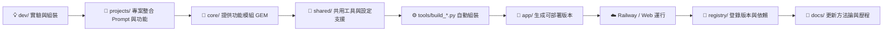

# 🧩 模組化創作系統方法論 2.0（個人導向工程架構版）

> 以「模組化思維」重構個人創作與開發流程，  
> 讓 AI 提示詞、程式邏輯與專案實驗在一個可維護、可重組、可部署的系統中自然生長。  

---

## 🧭 一、導論：從混亂到系統化的個人創作

在個人開發或創作過程中，我們常遇到三個困境：

| 問題 | 傳統狀況 | 結果 |
|------|-----------|------|
| 提示詞散亂 | 每次都重新寫 Prompt | 無法追蹤版本與重複利用 |
| 程式重疊 | 不同專案複製貼上 | 更新困難、版本衝突 |
| 專案無秩序 | 一個資料夾塞所有實驗 | 難以維護、無法上線 |

**方法論 2.0 的目標**是：  
> 將「AI 提示詞」與「程式碼」視為同等邏輯單元，  
> 讓兩者能在同一個工程化架構中被拆分、重組、測試與部署。  

---

## 🧩 二、核心架構（個人導向工程 2.0）

整個系統採用單人閉環開發模型：  
> 一切從「專案」開始，經過「邏輯層」與「共用層」的演化，  
> 最終在「運行層」上線，並透過「登錄層」與「文件層」維護。  

<pre>
📁 my-ai-system/
 ├─ projects/      🧩 專案層（每個主題各自獨立）
 ├─ core/          🧠 共用邏輯層（功能模組與核心邏輯）
 ├─ shared/        🧱 共用素材層（Prompt / 工具 / 設定）
 ├─ dev/           ⚙️ 開發與實驗層（Colab / VSCode）
 ├─ app/           🚀 運行層（雲端部署版本）
 ├─ registry/      🧾 登錄層（模組版本與依賴）
 └─ docs/          📘 文件層（方法論與設計筆記）
</pre>

---

## ⚙️ 三、設計原則

| 原則編號 | 名稱 | 關鍵理念 | 實作焦點 |
|-----------|--------|-----------|-----------|
| P1 | **Prompt 即程式碼 (PaC)** | 提示詞可版本化、可測試 | 放在 `shared/base_prompts` 與 `projects` |
| P2 | **模組化與單一職責 (SRP)** | 每個模組只負責一件事 | 拆分功能成獨立 `.py` 或 `.md` 檔案 |
| P3 | **關注點分離 (SoC)** | 資料、邏輯與組裝分離 | 明確資料夾分層 |
| P4 | **組合優於繼承 (Composition over Inheritance)** | 用組合堆疊功能 | `projects` 組合 `core` 模組與 Prompt |
| P5 | **DRY 原則 (Don't Repeat Yourself)** | 功能不重複定義 | 所有共用功能集中於 `core` 或 `shared` |
| P6 | **宣告式建構 (Declarative Assembly)** | 宣告「要什麼」，不寫「怎麼做」 | 由 `dev/tools/build_*.py` 自動組裝 |
| P7 | **SSOT 單一資料源 (Single Source of Truth)** | 所有狀態統一於共享結構 | 在 `registry` 維護統一狀態 |
| P8 | **可測試性 (Testability)** | 功能模組與 Prompt 均可單測 | `dev/tests` 與 `sandbox` 提供驗證環境 |

---

## 🧱 四、層級對應與運作機制

| 層級 | 角色 | 功能定位 | 與模組化關係 |
|------|------|-----------|---------------|
| `projects/` | **應用層** | 每個 idea 一個獨立專案 | 組合不同模組形成應用 |
| `core/` | **邏輯層** | 存放核心功能模組（GEM） | 各模組彼此獨立、低耦合 |
| `shared/` | **共用層** | 通用 Prompt、設定、工具 | 為核心模組提供依賴 |
| `dev/` | **實驗層** | 測試、原型開發與自動化工具 | 模組與 Prompt 的實驗場 |
| `app/` | **運行層** | 組裝後的最終成品 | 實際部署與展示層 |
| `registry/` | **版本層** | 模組與依賴的索引與變更紀錄 | SSOT 管理中心 |
| `docs/` | **知識層** | 方法論與設計思考記錄 | 系統的理論基礎與歷史檔案 |

---

## 🧩 五、模組設計單元（Module / GEM / Application）

| 層級 | 名稱 | 說明 | 類比軟體概念 |
|------|------|------|----------------|
| 🧩 **Module（功能模組）** | 單一職責功能，如「分析意圖」、「格式輸出」 | Function |
| 💎 **GEM（組合模組）** | 多個模組組合的功能集，可重用 | Package / Library |
| 🚀 **Application（應用層）** | 以專案或 Demo 形式存在的最終成品 | App / Service |

---

## 🔁 六、系統運作流程


📘 **說明：**
| 流程階段            | 功能             | 輸入           | 輸出        |
| --------------- | -------------- | ------------ | --------- |
| 💡 `dev/`       | 原型開發、Prompt 測試 | 初始概念         | 可運行的測試結果  |
| 🧩 `projects/`  | 組合 Prompt + 程式 | 模組、Prompt    | 專案原型      |
| 🧠 `core/`      | 提供通用邏輯         | 工具、模組        | GEM（功能組件） |
| 🧱 `shared/`    | 共用設定與模板        | 設定、通用 Prompt | 標準化支援     |
| ⚙️ `dev/tools/` | 自動組裝與同步        | 配方 JSON、模組   | 編譯後成品     |
| 🚀 `app/`       | 運行與展示          | 組裝後的應用       | 可上線版本     |
| ☁️ Railway      | 雲端部署           | 應用程式         | 網頁服務      |
| 🧾 `registry/`  | 紀錄版本與依賴        | 模組資訊         | 系統狀態與歷史   |
| 📘 `docs/`      | 方法論、實驗筆記       | 專案結果         | 知識回饋與文件更新 |


### 📘 7. 文件層 `docs/`

保存所有方法論、規格與實驗筆記。

```bash
docs/
 ├─ architecture.md
 ├─ build_process.md
 └─ experiments.md
```

📘 **說明：**

* `architecture.md`：整體架構文件
* `build_process.md`：組裝與部署流程
* `experiments.md`：測試與 Prompt 實驗紀錄

---

## 🔍 八、實作流程（個人開發循環）

| 階段      | 任務                   | 實際操作                                          | 產出          |
| ------- | -------------------- | --------------------------------------------- | ----------- |
| 1️⃣ 構思  | 想出新 idea             | 建立 `projects/<name>/`                         | 原型結構        |
| 2️⃣ 開發  | 撰寫功能與 Prompt         | 在 `scripts/`、`prompts/` 工作                    | 可執行原型       |
| 3️⃣ 抽象化 | 重複功能抽離               | 移入 `core/` 或 `shared/`                        | 可重用模組       |
| 4️⃣ 組裝  | 使用 `dev/tools/` 自動生成 | `build_code.py`、`build_prompt.py`             | 成品放入 `app/` |
| 5️⃣ 部署  | 上傳 Railway 或本地運行     | `deploy_to_railway.py`                        | 上線版本        |
| 6️⃣ 紀錄  | 更新版本與實驗結果            | `registry/changelog.md`、`docs/experiments.md` | 知識回饋系統      |

---

## 🧠 九、方法論的關鍵精神

> 「模組化創作系統」不是為團隊，而是為**創作者自己的思考節奏**設計。

| 概念                 | 說明                                |
| ------------------ | --------------------------------- |
| 🧩 **結構 ≠ 約束**     | 資料夾是為了幫你記得「放哪裡」，不是限制你「能放什麼」。      |
| ⚙️ **程式與提示詞是同類資產** | Prompt 是邏輯的一部分，應與程式碼同等管理。         |
| 💎 **模組化是成長機制**    | 當功能被重複使用三次，就應該升級成 GEM。            |
| 📘 **文件即記憶**       | 每一次調整、實驗都應寫入 `docs/`，讓系統成為自己的教科書。 |

---

## 🧾 十、結語：個人導向工程的演化方向

> 最終的目標不是「做完一個系統」，
> 而是讓系統「能長出更多系統」。

方法論 2.0 的核心是讓：

* 你的 **想法** → 專案
* 你的 **邏輯** → 模組
* 你的 **經驗** → 文件
* 你的 **成果** → 可重用 GEM

當這三者能彼此交換資訊、共用規則、持續進化，
你就擁有了一個「自我成長型」的 AI 工程架構。

---
