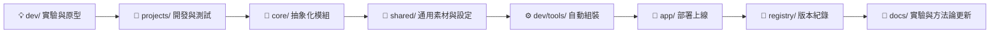

# 📘 模組化創作系統操作手冊 2.0  
> **對應架構：個人導向工程 2.0**  
> **適用對象：** 個人開發者、AI 實驗創作者  
> **目的：** 將「模組化創作系統方法論」轉化為具體開發與部署步驟  

---

## 🧭 一、系統操作總覽

本操作手冊對應的資料結構如下：

<pre>
📁 my-ai-system/
 ├─ projects/      🧩 專案層（每個主題各自獨立）
 ├─ core/          🧠 共用邏輯層（功能模組）
 ├─ shared/        🧱 共用素材層（Prompt / 工具 / 設定）
 ├─ dev/           ⚙️ 開發與實驗層（Colab / VSCode）
 ├─ app/           🚀 運行層（雲端部署版本）
 ├─ registry/      🧾 登錄層（版本與依賴）
 └─ docs/          📘 文件層（方法論與筆記）
</pre>

整體操作流程：
> 構思 Idea → 建立專案 → 實作與測試 → 模組化 → 組裝成品 → 部署 → 記錄  

---

## 🧩 二、建立新專案

### 🎯 目的：
建立一個能同時放程式、Prompt、資料、結果的獨立環境。

### 🪜 操作步驟：

1. 在 `projects/` 下建立專案資料夾，例如：
   ```bash
   mkdir projects/ai_report_generator
   cd projects/ai_report_generator
2. 建立基本結構：

   ```bash
   mkdir scripts prompts data results
   ```

3. 建立初始檔案：

   ```bash
   touch scripts/main.py prompts/base_prompt.md data/sample_input.json
   ```

4. 在 `README.md` 中簡要說明專案目標：

   ```markdown
   # AI Report Generator
   - 功能：從資料自動生成報告
   - 主要模組：report_builder
   - 主要 Prompt：write_report.md
   ```

✅ **完成後的結構：**

```
projects/ai_report_generator/
 ├─ scripts/main.py
 ├─ prompts/base_prompt.md
 ├─ data/sample_input.json
 ├─ results/
 └─ README.md
```

---

## 🧠 三、開發與模組化（core/）

### 🎯 目的：

將「可重複使用」的功能抽離成模組，集中管理。

### 🪜 操作步驟：

1. 確定某段邏輯（如格式化、分析）會被多個專案使用。

2. 建立新模組目錄：

   ```bash
   mkdir -p core/bundles/report_builder
   ```

3. 建立功能檔案：

   ```bash
   touch core/bundles/report_builder/structure_analysis.py
   ```

4. 撰寫範例模組：

   ```python
   # core/bundles/report_builder/structure_analysis.py
   def analyze_structure(data):
       """解析資料結構"""
       return {"sections": len(data.keys()), "fields": list(data.keys())}
   ```

5. 在專案中引用：

   ```python
   from core.bundles.report_builder.structure_analysis import analyze_structure
   ```

6. 測試模組：

   ```bash
   python -m unittest core/bundles/report_builder/tests/test_structure_analysis.py
   ```

---

## 💬 四、Prompt 模組管理（shared/）

### 🎯 目的：

讓提示詞可以像程式一樣被版本控制、共用與組裝。

### 🪜 操作步驟：

1. 在 `shared/base_prompts/` 建立共用 Prompt：

   ```bash
   touch shared/base_prompts/format_json.md
   ```

2. 寫入內容：

   ```markdown
   ## JSON Format Policy
   - Always return valid JSON.
   - Use double quotes.
   - Include all required fields.
   ```

3. 在專案 Prompt 中引用共用模板：

   ```markdown
   
   ```

4. 使用 `dev/tools/build_prompt.py` 組裝：

   ```bash
   python dev/tools/build_prompt.py --project ai_report_generator
   ```

✅ 組裝結果：

```
app/prompts/ai_report_generator_final.md
```

---

## ⚙️ 五、自動組裝（dev/tools）

### 🎯 目的：

將專案程式與 Prompt 統一編譯成「可部署成品」。

### 🪜 操作步驟：

1. 準備自動化腳本（範例 `build_code.py`）：

   ```python
   import shutil, os

   def build_app(project):
       src = f"projects/{project}/scripts"
       dst = f"app/code/{project}"
       os.makedirs(dst, exist_ok=True)
       for f in os.listdir(src):
           if f.endswith(".py"):
               shutil.copy(os.path.join(src, f), dst)
       print(f"✅ {project} build complete")

   if __name__ == "__main__":
       build_app("ai_report_generator")
   ```

2. 執行組裝：

   ```bash
   python dev/tools/build_code.py
   ```

3. 驗證輸出：

   ```
   app/code/ai_report_generator/main.py
   app/prompts/ai_report_generator_final.md
   ```

---

## 🚀 六、部署應用（app/ → Railway）

### 🎯 目的：

將已組裝的應用快速上線。

### 🪜 操作步驟：

1. 準備 `app/api/main.py`：

   ```python
   from fastapi import FastAPI
   app = FastAPI()

   @app.get("/")
   def index():
       return {"status": "AI app running!"}
   ```

2. 建立 `Procfile`：

   ```
   web: uvicorn app.api.main:app --host 0.0.0.0 --port $PORT
   ```

3. 上傳到 GitHub：

   ```bash
   git add .
   git commit -m "Deploy AI report generator"
   git push origin main
   ```

4. 在 Railway 連接你的 GitHub 專案
   → 選擇主分支
   → 點擊「Deploy」。

✅ 部署完成後：
Railway 會自動啟動你的 FastAPI 應用，
可於 `https://<your-app>.up.railway.app` 存取。

---

## 🧾 七、版本與文件更新（registry + docs）

### 🎯 目的：

讓系統能追蹤自身變化、保留每次改進的知識。

### 🪜 操作步驟：

1. 更新模組登錄：

   ```json
   // registry/index.json
   {
     "modules": {
       "report_builder": { "version": "1.2.0", "description": "報告生成模組" }
     }
   }
   ```

2. 更新變更紀錄：

   ```markdown
   ## v1.2.0 - 2025/11/07
   - 新增 report_builder 模組
   - 優化 prompt 組裝流程
   ```

3. 在 `docs/experiments.md` 紀錄測試結果：

   ```markdown
   ### 實驗紀錄
   - Prompt: write_report.md
   - 模型：gpt-4o-mini
   - 成果：摘要結構穩定，生成邏輯一致
   ```

---

## 🧠 八、個人開發循環（橫向流程）



---

## ✅ 九、維護建議與最佳實踐

| 任務        | 建議方式                       | 備註                   |
| --------- | -------------------------- | -------------------- |
| Prompt 管理 | 統一放 `shared/base_prompts/` | 用 include 語法或工具組裝    |
| 模組開發      | 一模組一資料夾，含 `__init__.py`    | 可直接轉成 Python package |
| 測試        | 所有模組與 Prompt 可單測           | 可用 pytest 或 unittest |
| 版本控制      | 模組升級即更新 `registry/`        | 版本號遵循 semver         |
| 文件撰寫      | 每次修改皆更新 `docs/`            | 當作「知識日誌」             |

---

## 🧩 十、結語

> 模組化創作系統操作手冊 2.0
> 不只是技術文件，而是「**讓想法持續長成產品的操作模板**」。

它的設計邏輯是：

* 從實驗開始，而不是從系統開始；
* 從創作者思維出發，而不是工程師流程；
* 讓每個檔案都有其位置、每次修改都有記錄。

最終，你會擁有一個：

> **能自行組裝、能追蹤版本、能部署上線、能回顧知識** 的 AI 開發系統。

---

```

---

是否要我幫你接著生成  
📘 **《操作手冊 2.0 — 圖像化版本》**（附操作流程圖 + 架構圖 + 檔案對照表）？  
👉 讓它成為你 GitHub `/docs` 裡的主導教學頁（可視化版本）。
```
