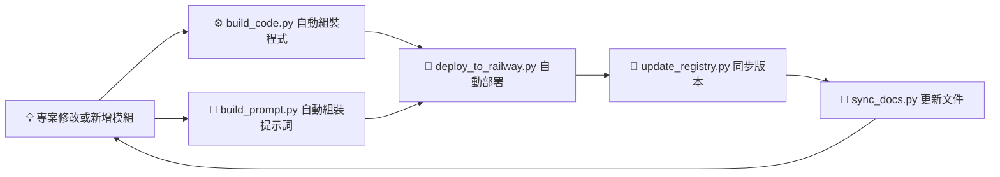

# ⚙️ 自動化與同步架構指南 2.0
> 對應架構：個人導向工程 2.0  
> 目的：讓 Prompt、程式碼與版本文件能自動生成、同步與部署  
> 適用：單人開發、持續演進的模組化 AI 系統

---

## 🧭 一、整體目標

在個人導向工程架構中，`dev/tools/` 是系統的「自動運轉中心」。  
它負責：
- 組裝程式與提示詞  
- 部署成可執行應用  
- 同步版本與文件  
- 讓整個系統能自己維護自己  

---

## 🧱 二、資料夾定位

<pre>
dev/
 ├─ notebooks/      → 原型測試
 ├─ scripts/        → 單次執行工具
 ├─ sandbox/        → 快速實驗專案
 └─ tools/          → 🧠 自動化中心
      ├─ build_code.py
      ├─ build_prompt.py
      ├─ deploy_to_railway.py
      ├─ update_registry.py
      └─ sync_docs.py
</pre>

---

## 🧩 三、核心自動化流程（橫向視圖）

```mermaid
graph LR
A[💡 專案程式與 Prompt] --> B[⚙️ build_code.py 組裝 Python 程式]
A --> C[💬 build_prompt.py 組裝提示詞]
B --> D[🧩 app/code/ 成品輸出]
C --> E[💬 app/prompts/ 組裝結果]
D --> F[🚀 deploy_to_railway.py 自動部署]
E --> F
F --> G[🧾 update_registry.py 更新版本]
G --> H[📘 sync_docs.py 同步方法論與日誌]

## 🧠 四、主要工具說明與範例

### 1️⃣ `build_code.py` — 組裝程式模組

**用途：**
自動收集 `projects/<name>/scripts/` 中的程式，
整合 `core/` 與 `shared/` 依賴，輸出成 `app/code/<name>/`。

**範例：**

```python
import os, shutil

def build_code(project):
    src = f"projects/{project}/scripts"
    dst = f"app/code/{project}"
    os.makedirs(dst, exist_ok=True)

    for file in os.listdir(src):
        if file.endswith(".py"):
            shutil.copy(os.path.join(src, file), os.path.join(dst, file))
    print(f"✅ Code built for {project}")

if __name__ == "__main__":
    build_code("ai_report_generator")
```

**實際操作：**

```bash
python dev/tools/build_code.py
```

**結果輸出：**

```
app/code/ai_report_generator/main.py
```

---

### 2️⃣ `build_prompt.py` — 組裝提示詞

**用途：**
自動合併多個 Prompt 模板（如系統規則、格式、主功能），
生成一份可直接用於部署或測試的完整提示詞。

**範例：**

```python
import os, json

def build_prompt(project):
    config_path = f"projects/{project}/prompt_recipe.json"
    with open(config_path) as f:
        recipe = json.load(f)

    output = []
    for file in recipe["components"]:
        with open(f"shared/base_prompts/{file}", encoding="utf-8") as part:
            output.append(part.read())
    with open(f"projects/{project}/prompts/{recipe['main']}", encoding="utf-8") as main:
        output.append(main.read())

    result = "\n\n".join(output)
    os.makedirs("app/prompts", exist_ok=True)
    with open(f"app/prompts/{project}_final.md", "w", encoding="utf-8") as out:
        out.write(result)
    print(f"✅ Prompt built for {project}")

if __name__ == "__main__":
    build_prompt("ai_report_generator")
```

**實際操作：**

```bash
python dev/tools/build_prompt.py
```

**結果輸出：**

```
app/prompts/ai_report_generator_final.md
```

---

### 3️⃣ `deploy_to_railway.py` — 自動部署

**用途：**
將最新的 `app/` 檔案自動推送至 Railway 或其他雲端環境。

**範例：**

```python
import os, subprocess

def deploy():
    os.system("git add .")
    os.system('git commit -m "Auto Deploy"')
    os.system("git push origin main")
    subprocess.run(["railway", "up"])

if __name__ == "__main__":
    deploy()
```

**效果：**

* 自動提交與推送
* Railway 會自動偵測 `Procfile` 並部署應用

---

### 4️⃣ `update_registry.py` — 同步版本登錄

**用途：**
自動檢查模組或 Prompt 更新，
將版本與日期記錄進 `registry/index.json` 與 `changelog.md`。

**範例：**

```python
import json, datetime

def update_registry(module, version):
    data = json.load(open("registry/index.json", encoding="utf-8"))
    data["modules"][module]["version"] = version
    json.dump(data, open("registry/index.json", "w", encoding="utf-8"), indent=2)

    with open("registry/changelog.md", "a", encoding="utf-8") as log:
        log.write(f"\n## {module} v{version} - {datetime.date.today()}\n- 自動更新版本資訊\n")
    print(f"✅ Registry updated for {module} v{version}")

if __name__ == "__main__":
    update_registry("report_builder", "1.3.0")
```

---

### 5️⃣ `sync_docs.py` — 同步文件與實驗紀錄

**用途：**
在版本更新時，自動附加到 `docs/experiments.md`，
記錄新的 Prompt 測試結果與方法論變化。

**範例：**

```python
from datetime import datetime

def sync_docs(project, note):
    with open("docs/experiments.md", "a", encoding="utf-8") as doc:
        doc.write(f"\n### {project} - {datetime.now().strftime('%Y-%m-%d %H:%M')}\n")
        doc.write(f"{note}\n")
    print(f"🧾 Synced documentation for {project}")

if __name__ == "__main__":
    sync_docs("ai_report_generator", "新增報告生成格式測試，表現穩定。")
```

---

## 🔁 五、GitHub Actions 自動化配置

**目的：**
讓上述五個腳本在推送（`git push`）後自動執行。

**檔案：** `.github/workflows/auto_build.yml`

```yaml
name: Auto Build and Deploy

on:
  push:
    branches: [ "main" ]

jobs:
  build-deploy:
    runs-on: ubuntu-latest
    steps:
      - uses: actions/checkout@v3
      - name: Setup Python
        uses: actions/setup-python@v4
        with:
          python-version: "3.11"
      - name: Install Dependencies
        run: pip install -r requirements.txt
      - name: Build Code
        run: python dev/tools/build_code.py
      - name: Build Prompts
        run: python dev/tools/build_prompt.py
      - name: Deploy to Railway
        run: python dev/tools/deploy_to_railway.py
      - name: Update Registry
        run: python dev/tools/update_registry.py
      - name: Sync Docs
        run: python dev/tools/sync_docs.py
```

✅ 推送後，整個流程自動完成：

> 組裝 → 部署 → 登錄 → 文件更新

---

## 📘 六、自動化開發循環（橫向流程）



💡 **說明：**
整個系統成為「自我更新迴圈」：
任何改動 → 觸發組裝 → 自動部署 → 自動記錄 → 回饋知識層。

---

## 🧱 七、最佳實踐建議

| 任務        | 建議                          | 備註                |
| --------- | --------------------------- | ----------------- |
| Prompt 組裝 | 用 `prompt_recipe.json` 定義結構 | 方便版本控制與合併         |
| 程式組裝      | 每個專案獨立輸出到 `app/code`        | 避免污染全域命名          |
| 部署        | Railway 自動化 + 手動驗證          | 每次更新後立即測試         |
| 文件同步      | 永遠自動追加，不覆蓋舊紀錄               | 形成時間序列知識庫         |
| 版本管理      | 遵循 Semantic Versioning      | 如 v1.2.1 → bug 修正 |

---

## 🧠 八、結語

> 自動化與同步不是為了偷懶，
> 而是為了讓你的創作系統能「自己維持健康」。

當你完成這份架構後，
你的開發環境會變成一個 **自我迴圈的創作生態**：

* 想法一出 → 自動生成程式與提示詞
* 上線後 → 自動記錄與更新
* 每次修改 → 變成新版本的知識積木

✅ 這就是個人導向工程 2.0 的最終狀態：

> **一個會自己更新、自己記錄、自己學習的 AI 系統。**

```

---

是否要我幫你接著生成下一份文件：  
💎 **《GEM 開發與維護手冊 2.0》**（講 core 模組與邏輯管理）？
```
